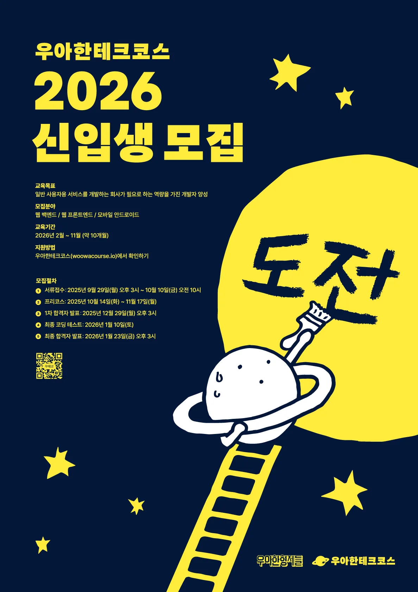

# 🪐 woowacourse-precourse-archive

[우아한테크코스]() 8기를 진행하며 학습한 내용을 정리한 문서입니다.

---

## 🪐 프리코스

### 기간

- 2025.10.14 ~ 2025.11.17

### 진행한 미션

| Project    | Repository                                                                         | Pull Request                                                               |
|------------|------------------------------------------------------------------------------------|----------------------------------------------------------------------------|
| 1. 문자열 덧셈기 | [kotlin-calculator-8](https://github.com/rungeun/kotlin-calculator-8/tree/rungeun) | [PR](https://github.com/woowacourse-precourse/kotlin-calculator-8/pull/60) |
| 2. 자동차 경주  | [kotlin-racingcar-8](https://github.com/rungeun/kotlin-racingcar-8/tree/rungeun)   | [PR](http://github.com/woowacourse-precourse/kotlin-racingcar-8/pull/47)   |
| 3. 로또      | [kotlin-lotto-8](https://github.com/rungeun/kotlin-lotto-8/tree/rungeun)           | [PR](https://github.com/woowacourse-precourse/kotlin-lotto-8/pull/60)      |

<!-- | 4.  | [kotlin--8](https://github.com/rungeun/kotlin--8/tree/rungeun)                     | [PR](https://github.com/woowacourse-precourse/kotlin--8/pull/) | -->
<!-- | 5.  | [kotlin--8](https://github.com/rungeun/kotlin--8/tree/rungeun)                     | [PR](https://github.com/woowacourse-precourse/kotlin--8/pull/) | -->

### 회고록

- [1주차 회고록]()
- [2주차 회고록]()
- [3주차 회고록]()

<!-- -[4주차 회고록]()-->
<!-- -[5주차 회고록]()-->
<!-- -[프리코스 참여 후기]()-->

### 피드백 정리

- [1주차 피드백]()
- [2주차 피드백]()

<!-- -[3주차 피드백]()-->
<!-- -[4주차 피드백]()-->
<!-- -[5주차 피드백]()-->

### 체크리스트

- [통합 체크리스트]()

### 공부하며 정리한 자료
- 1주차
  - [git 커밋 메세지 컨벤션](week1/git%20커밋%20메세지%20컨벤션.md)
- 2주차
  - 